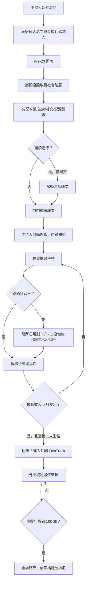

# 百歲人生 Money Game — 遊戲簡介

> 一場 90 分鐘的人生旅程，從 20 歲活到 100 歲，看誰最後最幸福。

---

## 遊戲是什麼？

**百歲人生** 是一款多人即時線上工作坊遊戲，以《財富流（Cashflow）》為設計原型，大幅擴充職業選擇、人際關係、健康管理與人生事件，讓玩家在 60–120 分鐘內體驗一整段虛擬人生的財務與人生抉擇。

遊戲不只比誰最有錢——最終以「幸福總分」評分，財富、健康、人際、體驗與傳承缺一不可。

---

## 核心特色

### 真實時間驅動的人生旅程
遊戲年齡不靠回合計算，而是**由真實時鐘直接驅動**。遊戲開始 = 玩家 20 歲，時間到 = 所有人 100 歲，同時結算。主持人可隨時暫停時鐘。

| 遊戲時長 | 類型 |
|---------|------|
| 60 分鐘 | 快速場 |
| 90 分鐘 | 標準場（預設） |
| 120 分鐘 | 長場 |

---

### Pre-20 投胎開局
遊戲開始前，玩家先「投胎」決定起點——階層隨機，後天靠自己。

- **擲骰決定社會階層**（富裕 / 中等 / 小康 / 貧窮），影響起始成長點數與現金
- **分配四維屬性**：學識、健康、社交、資源，決定初始財商值（FQ）、健康值（HP）與人脈值（NT）
- **選擇是否繼續進修**：借學貸 $30,000，但解鎖醫生、律師、IT 工程師等高階職業

---

### ESBI 四象限職業系統
超過 **30 種職業**橫跨 E、S、B、I 四大象限，薪資結構、時間自由度與成長路徑各不相同。

| 象限 | 說明 | 特色 |
|------|------|------|
| **E** 受薪族 | 固定月薪，穩定但上限低 | 每發薪日限 1 次活動 |
| **S** 自僱者 | 薪資隨機、人脈驅動或技能驅動 | 部分職業有彈性行程 |
| **B** 企業主 | 薪資極低，靠事業被動收入 | 行程完全自由 |
| **I** 投資者 | 無薪資，靠投資組合股息 | 初始高財商，行程完全自由 |

中途還可透過**累積第二專長值（SK）至 100** 完成轉職，徹底改變職業跑道。

---

### 雙圈棋盤設計

```
內圈（老鼠賽跑，25 格）
  → 路過「第二人生」格 + 被動收入 ≥ 月總支出
    → 脫出！進入外圈（財務自由 FastTrack，17 格）
```

**內圈**每圈設有 4 個發薪日格，格子類型包含：小交易、大交易、意外支出（Doodad）、市場行情、人際關係、危機事件、添丁、裁員、慈善捐款等。

**外圈**進入後優勢顯著：
- 所有被動收入 × **2.0** 倍
- 每個發薪日所有資產市值 × **1.15**（+15% 複利增值）
- 外圈發薪日格額外觸發「資產總市值 × 1%」紅利現金

---

### 多元人生系統

遊戲中充滿需要抉擇的人生事件，每一步都影響最終幸福分：

| 系統 | 內容 |
|------|------|
| **婚姻** | 自然戀愛（DRS 累積）、主持人媒合、買賣婚姻三條路徑，影響月收入與體驗值 |
| **子女** | 添丁格自動生育，每個孩子月支出 +$500，但提升家庭分與節稅 |
| **旅遊** | 20 個目的地（台灣到南極），花費現金與 HP，換取生命體驗值與屬性加成 |
| **健康 HP** | 每發薪日自然衰退，老年後加速；HP 歸零進入臥床狀態，有 30% 機率自然死亡 |
| **保險** | 醫療、壽險、財產三種，決定危機事件能否豁免高額費用 |
| **借貸與信用** | 信用值影響借款利率（0.5%–2% / 月）與上限，應急借款傷信用 |
| **轉職** | SK 累積達 100 即可換職業，重置 SK 但薪資支出同步更新 |
| **危機事件** | 心臟病、天災、訴訟等，無保險且現金不足可能觸發死亡 |

---

### 主持人全局事件
主持人可隨時觸發影響全場所有玩家的宏觀事件，讓遊戲充滿變數：

| 事件 | 效果 |
|------|------|
| 股市大崩盤 | 所有股票市值 × 0.5 |
| 股市大漲 | 所有股票市值 × 2.0 |
| 全球疫情爆發 | 所有事業現金流 × 0.4，月支出永久 +$400 |
| 通貨膨脹 | 所有玩家月支出永久 +$300 |
| 房市崩盤 | 所有房地產市值 × 0.6 |
| 大型自然災害 | 房地產市值 × 0.7，月支出永久 +$500 |

---

## 玩法流程



---

## 角色說明

| 角色 | 入口 URL | 功能 |
|------|---------|------|
| **玩家** | `/` | 手機操作，擲骰、行動、查看財報 |
| **主持人** | `/?admin` | 建立房間、控制時鐘、觸發全局事件、調整玩家數值 |
| **大螢幕** | `/?display` | 投影至大螢幕，顯示即時排行、時鐘與全場動態 |

---

## 評分系統

遊戲結束（虛擬 100 歲）時，依 **幸福總分（0–100 分）** 決定排名，提早死亡的玩家仍納入結算。

```
幸福總分 = 生命體驗指數 × 40%
          + 人生成就指數 × 30%
          + 人際關係指數 × 30%
```

### 三大幸福指數組成

| 指數 | 組成 |
|------|------|
| 生命體驗指數 | 體驗值 × 40% ＋ 健康 × 40% ＋ 壽命 × 20% |
| 人生成就指數 | 淨資產 × 35% ＋ 被動收入 × 35% ＋ 傳承 × 30% |
| 人際關係指數 | 家庭 × 50% ＋ 人脈值 × 50% |

### 等級評定

| 分數 | 等級 |
|------|------|
| ≥ 85 | **S** |
| ≥ 70 | A |
| ≥ 55 | B |
| ≥ 40 | C |
| < 40 | D |

### 10 種成就徽章

| 徽章 | 解鎖條件 |
|------|---------|
| 財務自由 | 成功進入外圈 |
| 百歲人瑞 | 活到 99 歲以上 |
| 世界旅人 | 造訪 5 個以上旅遊目的地 |
| 家庭至上 | 已婚且子女 ≥ 2 |
| 鐵打身體 | 最終健康值 ≥ 80 |
| 智慧投資 | 淨資產 ≥ $50,000 |
| 被動收入王 | 月被動收入 ≥ $3,000 |
| 無債一身輕 | 總負債 = $0 |
| 傳承者 | 遺產淨值 ≥ $100,000 |
| 人脈大師 | 人脈值 ≥ 8 |

---

## 技術特色

- **即時多人連線**：Socket.io 支援多房間同時進行，資料完全隔離
- **手機即可遊玩**：玩家介面為行動裝置優化的 React 響應式設計
- **豐富的遊戲後分析**：個人決策時間軸、雷達圖、財務成長歷程，協助反思學習

---

*更完整的規則請參閱 [GAME_MECHANICS.md](GAME_MECHANICS.md)*
